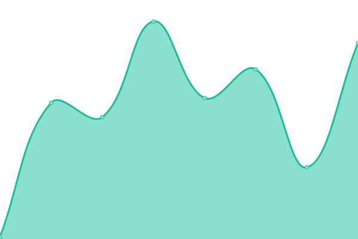

# [📈 Live Status](https://https://www.coincord.co): <!--live status--> **🟧 Partial outage**

This repository contains the open-source uptime monitor and status page for [Coincord Technologies Inc](https://coincord.co), powered by [Upptime](https://github.com/upptime/upptime).

With [Upptime](https://upptime.js.org), you can get your own unlimited and free uptime monitor and status page, powered entirely by a GitHub repository. We use [Issues](https://github.com/upptime/upptime/issues) as incident reports, [Actions](https://github.com/Coincor/coincord-status/actions) as uptime monitors, and [Pages](https://https://www.coincord.co) for the status page.

<!--start: status pages-->
<!-- This summary is generated by Upptime (https://github.com/upptime/upptime) -->
<!-- Do not edit this manually, your changes will be overwritten -->
<!-- prettier-ignore -->
| URL | Status | History | Response Time | Uptime |
| --- | ------ | ------- | ------------- | ------ |
|  [Coincord Website](https://www.coincord.co) | 🟩 Up | [coincord-website.yml](https://github.com/coincord/coincord-status/commits/HEAD/history/coincord-website.yml) | 

 153ms
     
 | 

<a href="https://status.coincord.co/history/coincord-website">100.00%</a>
    

|  [Coincord Documentation](https://developers.coincord.co) | 🟩 Up | [coincord-documentation.yml](https://github.com/coincord/coincord-status/commits/HEAD/history/coincord-documentation.yml) | 

 61ms
     
 | 

<a href="https://status.coincord.co/history/coincord-documentation">100.00%</a>
    

|  Coincord Mobile API | 🟥 Down | [coincord-mobile-api.yml](https://github.com/coincord/coincord-status/commits/HEAD/history/coincord-mobile-api.yml) | 

 1234ms
     
 | 

<a href="https://status.coincord.co/history/coincord-mobile-api">100.00%</a>
    

<!--end: status pages-->

[**Visit our status website →**](https://coincord.github.io/coincord-status/)

## 📄 License

- Powered by: [Upptime](https://github.com/upptime/upptime)
- Code: [MIT](./LICENSE) © [Coincord](https://coincord.co)
- Data in the `./history` directory: [Open Database License](https://opendatacommons.org/licenses/odbl/1-0/)
